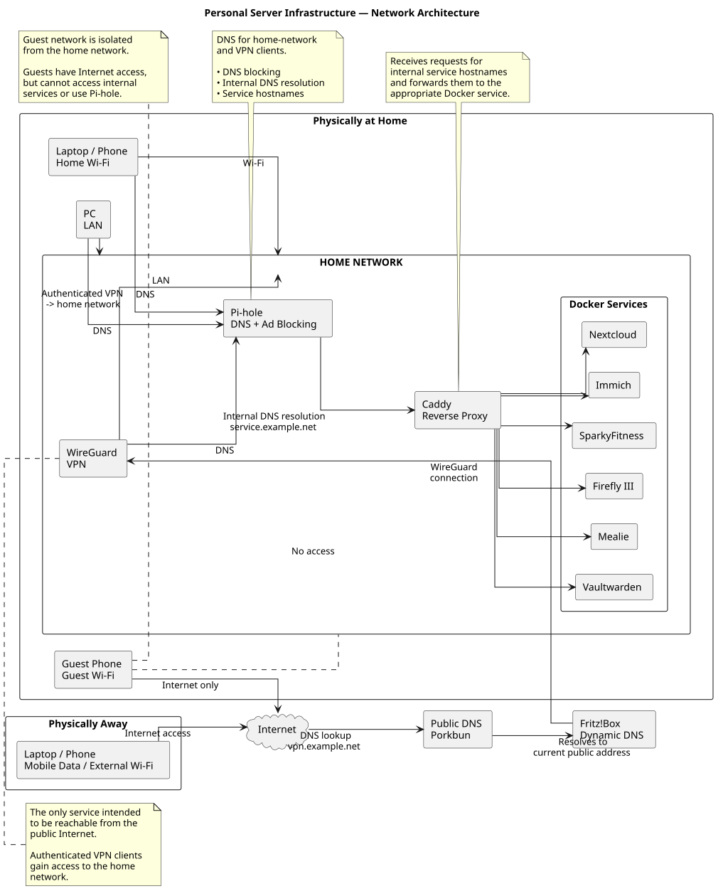

# Personal Server Infrastructure

A self-hosted infrastructure project running on a Debian Linux home server.

The system hosts several containerized applications and provides centralized DNS,
reverse proxying, VPN access, and automated backups.

This repository contains **documentation and sanitized configuration examples**
of the infrastructure. It is not the deployment source of truth for the live
server.

## Architecture



The complete architecture is described in
[`docs/architecture.md`](docs/architecture.md).

The network architecture is defined as a PlantUML diagram in
[`docs/NetworkArchitecture.puml`](docs/NetworkArchitecture.puml).

## Services

| Service             | Purpose                           |
| ------------------- | --------------------------------- |
| Caddy               | Reverse proxy and TLS termination |
| WireGuard / WG-Easy | VPN access and management         |
| Pi-hole             | DNS resolution and ad blocking    |
| Nextcloud           | Cloud storage and synchronization |
| Immich              | Photo management                  |
| Vaultwarden         | Password management               |
| Mealie              | Recipe management                 |
| Firefly III         | Personal finance management       |
| SparkyFitness       | Fitness tracking                  |

## Infrastructure

* Debian Linux
* Docker / Docker Compose
* Caddy reverse proxy
* WireGuard VPN
* Pi-hole for DNS and ad blocking
* Internal service discovery via DNS
* Shared Docker network
* Containerized application stacks
* Nightly Restic backups
* Separate active storage and backup storage
* Guest network isolation

## Technical Focus

The project focuses on:

* Linux system administration
* Containerization and service orchestration
* Network segmentation and access control
* Reverse proxying and TLS
* Internal DNS
* VPN-based remote access
* Backup and recovery concepts
* Secure configuration management
* Infrastructure documentation

## Repository Structure

```text
.
├── docker/       # Sanitized Docker Compose examples
├── docs/         # Architecture and infrastructure documentation
└── restic/       # Sanitized backup script and configuration examples
```

The configuration examples use placeholders for domains, credentials,
paths, IP addresses, and other deployment-specific values.

## Documentation

* [Architecture](docs/architecture.md)
* [Networking](docs/networking.md)
* [Services](docs/services.md)
* [Security](docs/security.md)
* [Backup](docs/backup.md)
* [Clients](docs/clients.md)

## Disclaimer

The configuration examples in this repository are sanitized representations
of the live infrastructure. Secrets, private keys, application data,
credentials, and deployment-specific configuration are intentionally excluded.

Generative AI was used to help with the documentation.